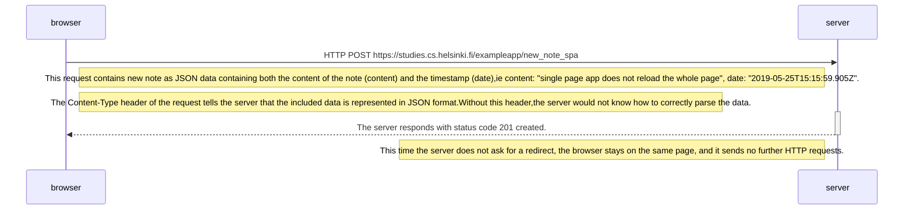

Exercise 06

```mermaid
sequenceDiagram
    participant browser
    participant server
    
    browser->>server: HTTP POST https://studies.cs.helsinki.fi/exampleapp/new_note_spa
    Note right of browser: This request contains new note as JSON data containing both the content of the note (content) and the timestamp (date),ie   content: "single       page app does not reload the whole page", date: "2019-05-25T15:15:59.905Z".
    Note right of browser:The Content-Type header of the request tells the server that the included data is represented in JSON format.Without this header,the server would not know how to correctly parse the data.
    
    activate server
    server-->>browser:The server responds with status code 201 created.
    deactivate server 
    Note left of server: This time the server does not ask for a redirect, the browser stays on the same page, and it sends no further HTTP requests.
```
